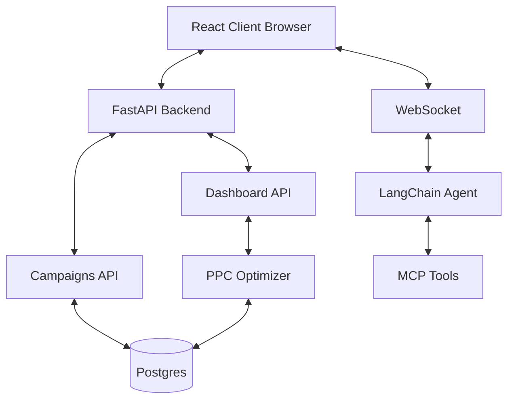

# Technical Architecture Document

## 1. High-Level Architecture
The application follows a standard Single Page Application (SPA) architecture with a decoupled frontend and backend.



*   **Campaigns:** Stored in **Postgres**. Campaigns API reads/writes campaign and strategy data.
*   **Dashboard:** Summary and chart-data can be mock initially; **AI actions** are produced by the **PPC Optimizer** from active campaigns and their `ai_mode`.
*   **Chat:** Single path via **WebSocket** to a **LangChain agent** with MCP tools (no REST chat).
*   **Data flow:** Browser calls REST API for dashboard and campaigns; WebSocket for chat. Dashboard metrics come from the API only (single source of truth).

## 2. Tech Stack

### Frontend
*   **Framework:** React 18+ (using Vite for build tooling).
*   **Language:** TypeScript (Strict mode).
*   **Styling:** Tailwind CSS (Utility-first).
    *   *Theme:* Dark mode default. Custom color palette defined in `tailwind.config.js`.
*   **State Management:** React Context API + Hooks (Keep it simple for prototype).
*   **Visualization:** Recharts (Responsive, composable charts).
*   **Icons:** Lucide-React or Heroicons.
*   **Routing:** React Router DOM v6.

### Backend
*   **Framework:** Python 3.11+ with FastAPI.
*   **Server:** Uvicorn (ASGI).
*   **Data:** Postgres (async via SQLAlchemy + asyncpg). Campaigns and related data are persisted.
*   **Data Validation:** Pydantic models.
*   **PPC Optimizer:** Rule-based service that produces bid/budget/keyword recommendations from campaign metrics and `ai_mode` (manual, auto_pilot, aggressive_growth, profit_guard). Feeds the dashboard AI actions feed.
*   **Chat:** WebSocket to a LangChain agent (OpenRouter) with MCP tools; agent created once per connection.

### Infrastructure (Local Dev)
*   **PackageManager:** `npm` (Frontend), `pip` (Backend).
*   **Concurrent Run:** Use a script or `concurrently` to run both servers.

## 3. Directory Structure
```
grok-admaster/
├── docs/                 # Documentation
├── client/               # React Frontend
│   ├── src/
│   │   ├── components/   # UI Components
│   │   ├── pages/        # Route Pages
│   │   ├── hooks/        # Custom Hooks
│   │   ├── types/        # TS Interfaces
│   │   └── api/          # API Client
├── server/               # Python Backend
│   ├── app/
│   │   ├── main.py       # Entry point
│   │   ├── api/          # Route handlers
│   │   ├── models/       # Pydantic models
│   │   └── services/     # Business logic (PPC optimizer, AI sim)
└── README.md
```

## 4. Key Decisions
*   **Why Tailwind?** Rapid UI development, easy implementation of a consistent dark theme.
*   **Why FastAPI?** Auto-generated API docs (Swagger), type safety, easy integration with Python-based AI logic in the future.
*   **Why Recharts?** React-native implementation, highly customizable for the "War Room" aesthetic.
