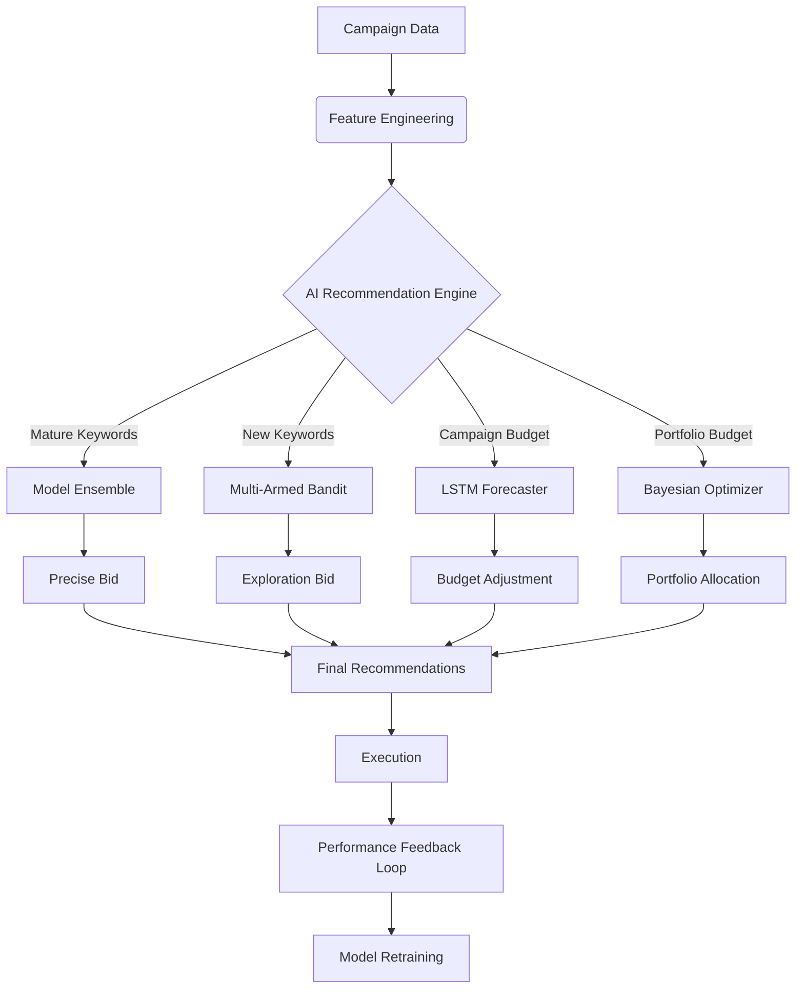

# Comprehensive AI Integration Strategy for PPC Optimization

## 1. Executive Summary

This strategy document outlines the roadmap for transforming the Grok AdMaster PPC engine from a **Rule-Based System** (Level 1) to a fully **AI-Driven Autonomous System** (Level 4).

The current system relies on static heuristics (e.g., "if ACoS > Target, reduce bid by 10%"). While functional, this approach lacks precision. By integrating the existing Advanced ML models (`ModelEnsemble`, `LSTMForecaster`, `BidBanditOptimizer`), we can achieve:

1.  **Precision Bidding**: Predicting the *exact* optimal bid for every keyword.
2.  **Proactive Budgeting**: Forecasting demand trends to allocate budget *before* opportunity is lost.
3.  **Intelligent Exploration**: Using Multi-Armed Bandits to find profitable bids for new keywords rapidly.
4.  **Anomaly Detection**: Automatically flagging and reacting to market shifts.

---

## 2. Architecture & Data Flow

The integration centers on upgrading the `ppc_optimizer.py` service to route decisions through the `ml/` package instead of static logic.

### High-Level Architecture



---

## 3. Model Portfolio & Specific Applications

The platform utilizes a portfolio of specialized models, each serving a distinct purpose in the optimization hierarchy.

### 3.1. Precision Bidding: `ModelEnsemble`
**Location**: `app/amazon_ppc_optimizer/ml/ensemble.py`
**Purpose**: The primary engine for updating bids on established keywords.

*   **How it works**: It combines four distinct models:
    1.  **Gradient Boosting**: robust, interpretable predictions based on decision trees.
    2.  **Deep Neural Network**: captures complex, non-linear patterns.
    3.  **Reinforcement Learning (DQN)**: optimizes for long-term reward rather than immediate ACoS.
    4.  **Multi-Armed Bandit**: provides exploration noise.
*   **Why it's useful**: A single model might fail in specific market conditions. An ensemble is far more robust. If the Deep NN is overconfident, the Gradient Boosting model grounds it.
*   **Integration Goal**: Replace `+/- 10%` logic with `ensemble.predict(features)`.

### 3.2. Trend Forecasting: `LSTMForecaster`
**Location**: `app/amazon_ppc_optimizer/ml/lstm_forecaster.py`
**Purpose**: Predicting future performance to adjust budgets proactively.

*   **How it works**: Uses Long Short-Term Memory (LSTM) networks to analyze 14-day time series data. It decomposes trends into seasonality, trend, and residual noise.
*   **Why it's useful**: Seasonality (e.g., higher traffic on weekends) is often missed by simple rules. LSTM can predict a Sunday spike on Friday and recommend a budget increase in advance.
*   **Integration Goal**: Use `forecast()` to determine daily budget caps.

### 3.3. New Keyword Exploration: `BidBanditOptimizer`
**Location**: `app/amazon_ppc_optimizer/ml/bandits.py`
**Purpose**: Rapidly finding the optimal bid for new keywords without historical data.

*   **How it works**: Uses **Thompson Sampling** and **UCB (Upper Confidence Bound)** algorithms. It treats every bid level (0.5x, 0.6x, ..., 1.5x) as an "arm" on a slot machine.
*   **Why it's useful**: Standard rules wait for 10-20 clicks before making a decision. Bandits make decisions immediately, balancing exploration (learning) and exploitation (profiting).
*   **Integration Goal**: Route any keyword with `< 1000` impressions to the Bandit optimizer.

### 3.4. Low-Data Estimation: `BayesianPredictor`
**Location**: `app/services/bayesian_predictor.py`
**Purpose**: Estimating Conversion Rate (CVR) and ACoS when data is scarce.

*   **How it works**: Uses Beta-Binomial conjugacy. Even with 0 orders and 5 clicks, it provides a *probability distribution* of the true CVR, rather than just saying "0%".
*   **Why it's useful**: Prevents premature negation of keywords that just got unlucky, and identifies "potential winners" early.
*   **Integration Goal**: Use `score_keywords_bayesian` to prioritize keywords for the Bandit or Ensemble.

---

## 4. Implementation Roadmap

### Phase 1: Feature Engineering & Connectivity (Days 1-2)
*   **Objective**: Connect the raw campaign data to the ML models.
*   **Actions**:
    *   Create `FeatureExtractor` in `ppc_optimizer.py` to convert Campaign/Keyword objects into the dictionary format expected by `ensemble.predict`.
    *   Ensure all necessary fields (Impressions, Clicks, Spend, Sales, CTR history) are available.

### Phase 2: Hybrid Bidding Engine (Days 3-5)
*   **Objective**: Deploy the Ensemble model for mature keywords.
*   **Actions**:
    *   Modify `compute_recommendations` to branch logic:
        *   **If** data sufficient → Call `ModelEnsemble`.
        *   **If** new keyword → Call `BidBanditOptimizer`.
        *   **Else** → Fallback to Rule-Based.
    *   Store "Reasoning" from the model in the Recommendation object (e.g., "Ensemble predicts $1.24 bid for 22% ACoS").

### Phase 3: Budget Intelligence (Days 6-8)
*   **Objective**: Integrate LSTM for budget management.
*   **Actions**:
    *   Implement `_recommend_budget_ai` using `LSTMForecaster`.
    *   Run forecasts weekly and adjust daily budgets based on predicted "high traffic" days.

### Phase 4: Feedback Loop & Training (Ongoing)
*   **Objective**: The system must get smarter over time.
*   **Actions**:
    *   Create a background job to capture `(Features, Action, Outcome)` daily.
    *   Implement `train_meta_learner` endpoint to update model weights based on weekly performance.

---

## 5. Precise Integration Steps (for `ppc_optimizer.py`)

To achieve the "preciseness" requested, we will modify `ppc_optimizer.py` to:

1.  **Import Models**:
    ```python
    from app.amazon_ppc_optimizer.ml.ensemble import ModelEnsemble
    from app.amazon_ppc_optimizer.ml.bandits import BidBanditOptimizer
    # Instantiate as global singletons (or dependency injected)
    ensemble_model = ModelEnsemble()
    bandit_model = BidBanditOptimizer()
    ```

2.  **Define `_recommend_ai_driven`**:
    ```python
    def _recommend_ai_driven(campaign: Any, keyword_metrics: List[dict]) -> List[Recommendation]:
        # 1. Feature Extraction
        # 2. Segment Keywords (Mature vs New)
        # 3. Batch Predict
        # 4. Generate Recommendations
    ```

3.  **Enhance Recommendation Object**:
    Add `confidence_score` and `model_used` to tracking.

## 6. Conclusion

This comprehensive strategy leverages the full power of the codebase's hidden ML capabilities. By moving to this architecture, Grok AdMaster will provide statistically superior results compared to rule-based competitors, adapting dynamically to market shifts rather than waiting for hard thresholds to be breached.
